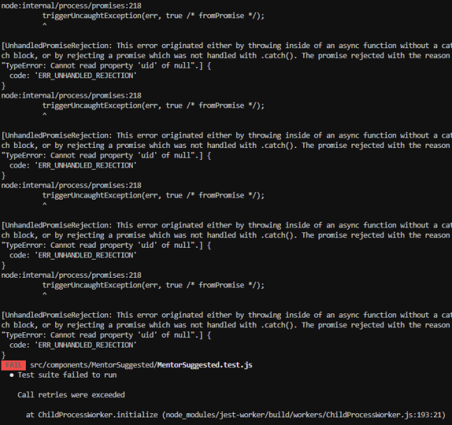

# Screenshot of errors:


# Testing Code:
## Testing Code For MentorHome.test.js:
```
import React from 'react';
import { render, unmountComponentAtNode } from 'react-dom';
import { BrowserRouter as Router } from 'react-router-dom';
import { mockWindowMatchMedia } from '../../helper-methods';
import MentorHome from './MentorHome';

let container = null;

mockWindowMatchMedia();

beforeEach(() => {
  container = document.createElement('div');
  document.body.appendChild(container);
});

afterEach(() => {
  // cleanup on exiting
  unmountComponentAtNode(container);
  container.remove();
  container = null;
});

test('render without crashing', () => {
  render(
    <Router>
      <MentorHome />
    </Router>,
    container,
  );
  expect(container.textContent).toBe(
    'test test test', // should fail
  );
});
```

## Testing Code For MentorSuggested.test.js:
```
/* eslint-disable react/jsx-props-no-spreading */

import React from 'react';

import { render, unmountComponentAtNode } from 'react-dom';

import { mockWindowMatchMedia } from '../../helper-methods';

import MentorSuggested from './MentorSuggested';

let container = null;

const mockFunction = jest.fn();

const props1 = {
  menteeUid: '',
  name: '',
  email: '',
  skills: '',
  description: '',
  request: false,
  acceptMentee: mockFunction,
  declineMentee: mockFunction,
};

mockWindowMatchMedia();

beforeEach(() => {
  container = document.createElement('div');
  document.body.appendChild(container);
});

afterEach(() => {
  // cleanup on exiting
  unmountComponentAtNode(container);
  container.remove();
  container = null;
});

test('render without crashing', () => {
  render(<MentorSuggested />, container);
  expect(container.textContent).toBe(
    'test test test', // should fail
  );
});

test('render the head of the card correctly', () => {
  render(<MentorSuggested {...props1} />, container);
  const head = document.getElementsByClassName('ant-card-head-title');
  expect(container.contains(head[0])).toBe(true);
});
```
