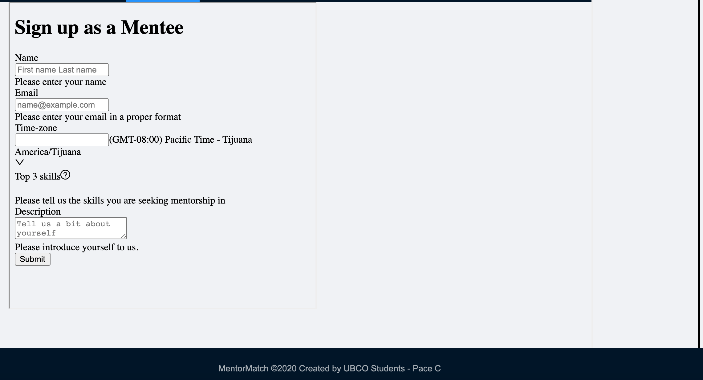
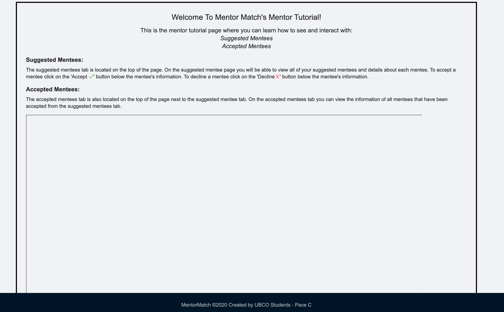
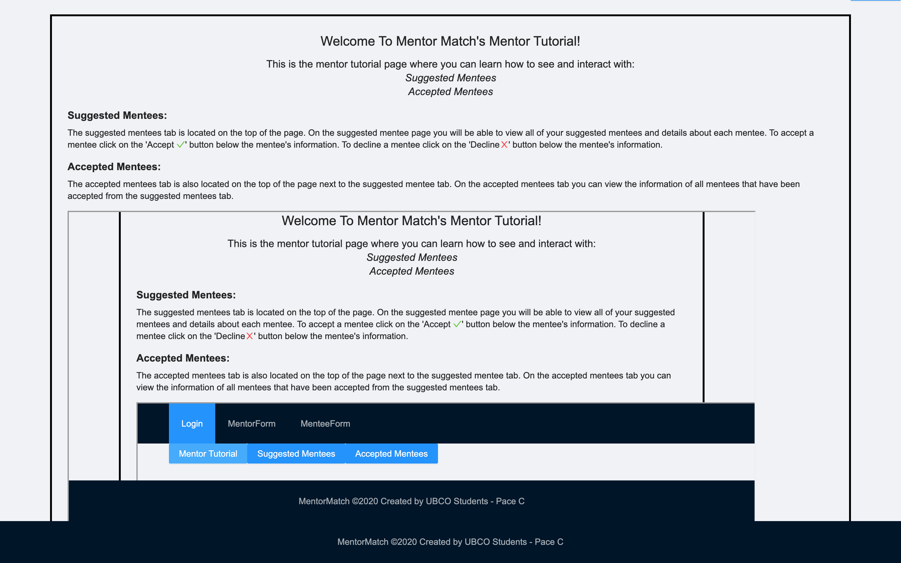
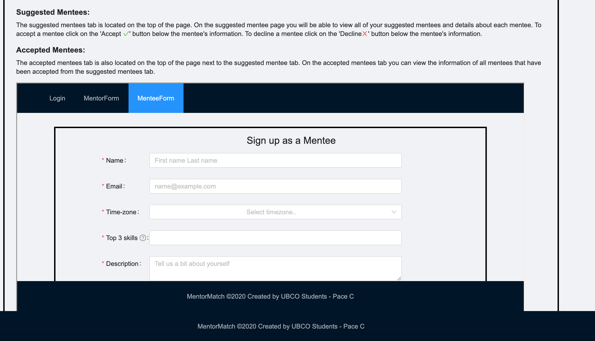

# Exploration of Rendering the Mentee Form to an iFrame Tag

## Jan 20-27's Sprint

### Findings/Attempted Methodology

When Researching how to Create an iFrame from a React Component:

1. I came across the [react-frame-component library] (https://github.com/ryanseddon/react-frame-component). To implement, I simply installed the library and wrapped everything that the component should return when rendered in a <Frame> tag. Upon testing, this resulted in the styling of the form being removed, which is definitely not what we want. The screenshot below displays the result of this.
   

2. My next train of thought was to then see if I could merely use the <iframe> tag. To test this, I put the iFrame tag within the ‘MentorTutorial’ component. I wanted to see what importing the MenteeForm component and using that within the src or srcDoc property would do. In both cases, the result was an empty iFrame display. The code that I used to test this was as follows:

```
<iframe
            srcDoc={MenteeForm}
            height="500"
            width="1100"
            title="testIframe"
          />
```



3. I then attempted something similar, but I tried to access the component through our file structure rather than importing the component. This, however, rendered our entire application within the frame window.

```
        <iframe
            src="../MenteeForm/MenteeForm.js" //changing 'src="MenteeForm"' produces the same result
            height="500"
            width="1100"
            title="testIframe"
          />
```

- As an aside: Yes, if you navigate to the 'MentorTutorial' component within the embedded iFrame, what I would deem as 'Menteeform-ception' occurs (or, I guess since the suffix '-ception' doesn't technically mean 'something nested within itself', I should really just say that recursion is the result).
  

4. It then dawned on me that iFrame tags typically seem to use URLS, and since our form would be embedded within external sites, we'd likely definitely want to use the URL that's hosting the form. So, within the tag’s src property, I tried to use the URL to access the Mentee component. The result of this, unfortunately was the same as the screenshot above, except it defaulted the display to be on the Mentee Form, rather than on the Login page.

```
        <iframe
            src="http://localhost:3000/MenteeForm"
            height="500"
            width="1100"
            title="testIframe"
          />
```



5. Since external sites need to be able to access the form, testing internally seems to be difficult. As such (when I have more time) I'm hoping to follow something similar as outlined [here](https://dev.to/damcosset/iframes-and-communicating-between-applications-31k5) and/or think of other possible ways in the meantime to go about this. Although the source I linked is aiming for different functionality, I came across it when initially thinking that we'd need to split the MenteeForm from our current app. Closer to develop, we'll remove the 'MenteeForm' and 'MentorForm' tabs, and the 'Login' component will be stand-alone. Admin accounts will essentially host the MentorForm (that potential Mentor users can access through email invite), while the MenteeForms will be available to public sites who embed them. Therefore, I'm thinking that a possible way to proceed would be as follows:

- Develop a separate React App to host the Mentee form (just copy over the MenteeForm files).
- In our current MenteeForm tab, embed the separate MenteeForm app via an iframe.

\*\*This is my initial train of thought. I'll do my best to look further into this to see if there's a way to host the MenteeForm separate from our current application.
