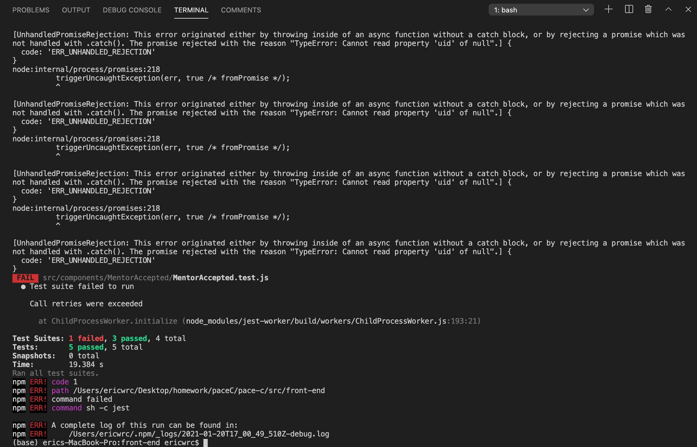

# Error screenshot

# Why the error occurred
During last week's sprint, I was working on adding unit tests on MentorCompletion.js and MentorAccepted.js. Unit tests for MentorCompletion were successfully implemented. However, When I tested MentorAccepted, the error above occurred. This happened probably because rendering mentorAccept page need to be authorized by FB as logged-in status, but this cannot be implemented within tests, which probably caused the current error. MentorAccepted.js is relatively complex than we expected. We can fix it in the future.
# Testing code
In MentorAccepted.test.js
```javascript
import React from 'react';
import { render, unmountComponentAtNode } from 'react-dom';
import { mockWindowMatchMedia } from '../../helper-methods';

import MentorAccepted from './MentorAccepted';

let container = null;

mockWindowMatchMedia();

beforeEach(() => {
  container = document.createElement('div');
  document.body.appendChild(container);
});

afterEach(() => {
  // cleanup on exiting
  unmountComponentAtNode(container);
  container.remove();
  container = null;
});

test('renders without crashing', () => {
  render(<MentorAccepted />, container);
  expect(container.textContent).toBe(
    'Accepted Mentees:Below you can view details about each accepted mentee',
  );
});

test('MentorDisplay page is connected to this page', () => {
  render(<MentorAccepted />, container);
  const dis = document.createElement('MentorDisplay');
  expect(container.contains(dis)).toBe(true);
});
```
